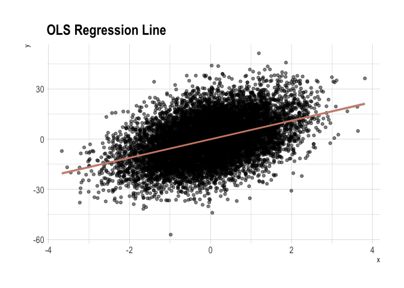
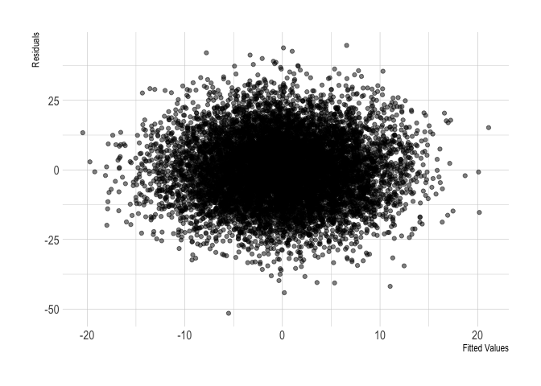
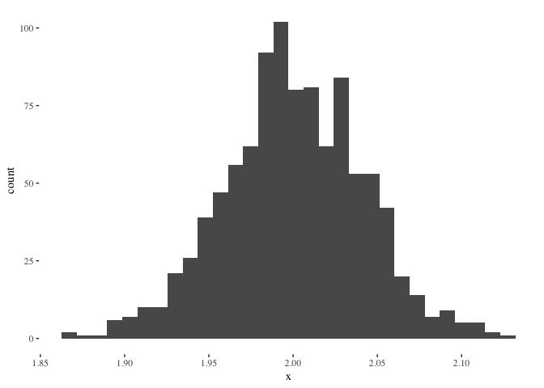
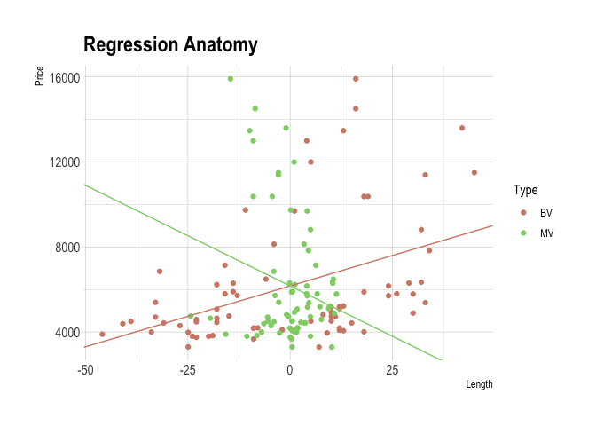

-   [OLS regression line](#ols-regression-line)
-   [Algebraic properties of OLS](#algebraic-properties-of-ols)
-   [Expected value of OLS](#expected-value-of-ols)
-   [Regression anatomy](#regression-anatomy)

% Properties of regression

OLS regression line
-------------------

    set.seed(1)

    # construct the data
    dat <- tibble(
      x = rnorm(1E4, 0, 1),
      u = rnorm(1E4, 0, 1),
      y = 5.5 * x + 12 * u
      )

    # run the regression
    reg <- lm(y ~ x, data = dat)

    # fitted values and residuals (two ways to recover them)
    dat %<>% mutate(
      yhat1 = predict(reg) %>% unname(),
      yhat2 = coef(reg)[1] + coef(reg)[2] * x,
      uhat1 = reg$residuals %>% unname(),
      uhat2 = y - yhat2
      )

    # check equality
    all.equal(dat$yhat1, dat$yhat2) & all.equal(dat$uhat1, dat$uhat2)

    ## [1] TRUE

    # figure 3
    ggplot(dat, aes(x, y)) +
      geom_point(alpha = 0.5) +
      stat_smooth(method = 'lm', col = 'red') +
      labs(title = 'OLS Regression Line') +
      ggthemes::theme_tufte()

    # figure 4
    ggplot(dat, aes(yhat1, uhat1)) +
      geom_point(alpha = 0.5) +
      labs(x = 'Fitted Values', y = 'Residuals') +
      ggthemes::theme_tufte()

Algebraic properties of OLS
---------------------------

    set.seed(1234)

    # construct the data
    dat <- tibble(
      x = 9 * rnorm(10, 0, 1),
      u = 36 * rnorm(10, 0, 1),
      y = 3 + 2 * x + u
      )

    # run the regression
    reg <- lm(y ~ x, data = dat)

    # algebraic calculations
    dat %<>% mutate(
      yhat = predict(reg) %>% unname(),
      uhat = reg$residuals %>% unname(),
      x_uhat = x * uhat,
      yhat_uhat = yhat * uhat
      )

    # table 6
    out <- rbind(dat, colSums(dat))
    out %<>% cbind(tibble(no = c(1:10, 'Sum')), .)
    names(out) <- c(
      names(out)[1:4],
      '$\\hat y$',
      '$\\hat u$',
      '$\\hat x \\hat u$',
      '$\\hat y \\hat u$'
      )

    knitr::kable(
      out,
      align = 'c',
      row.names = F,
      digits = 1,
      format = 'html'
      ) %>%
      kableExtra::row_spec(11, bold = T) %>%
      kableExtra::kable_styling()

<table class="table" style="margin-left: auto; margin-right: auto;">
<thead>
<tr>
<th style="text-align:center;">
no
</th>
<th style="text-align:center;">
x
</th>
<th style="text-align:center;">
u
</th>
<th style="text-align:center;">
y
</th>
<th style="text-align:center;">
*ŷ*
</th>
<th style="text-align:center;">
*û*
</th>
<th style="text-align:center;">
*x̂**û*
</th>
<th style="text-align:center;">
*ŷ**û*
</th>
</tr>
</thead>
<tbody>
<tr>
<td style="text-align:center;">
1
</td>
<td style="text-align:center;">
-10.9
</td>
<td style="text-align:center;">
-17.2
</td>
<td style="text-align:center;">
-35.9
</td>
<td style="text-align:center;">
-17.4
</td>
<td style="text-align:center;">
-18.5
</td>
<td style="text-align:center;">
200.9
</td>
<td style="text-align:center;">
322.0
</td>
</tr>
<tr>
<td style="text-align:center;">
2
</td>
<td style="text-align:center;">
2.5
</td>
<td style="text-align:center;">
-35.9
</td>
<td style="text-align:center;">
-27.9
</td>
<td style="text-align:center;">
-0.7
</td>
<td style="text-align:center;">
-27.2
</td>
<td style="text-align:center;">
-68.0
</td>
<td style="text-align:center;">
19.8
</td>
</tr>
<tr>
<td style="text-align:center;">
3
</td>
<td style="text-align:center;">
9.8
</td>
<td style="text-align:center;">
-27.9
</td>
<td style="text-align:center;">
-5.4
</td>
<td style="text-align:center;">
8.3
</td>
<td style="text-align:center;">
-13.8
</td>
<td style="text-align:center;">
-134.3
</td>
<td style="text-align:center;">
-114.8
</td>
</tr>
<tr>
<td style="text-align:center;">
4
</td>
<td style="text-align:center;">
-21.1
</td>
<td style="text-align:center;">
2.3
</td>
<td style="text-align:center;">
-36.9
</td>
<td style="text-align:center;">
-30.2
</td>
<td style="text-align:center;">
-6.7
</td>
<td style="text-align:center;">
141.4
</td>
<td style="text-align:center;">
202.3
</td>
</tr>
<tr>
<td style="text-align:center;">
5
</td>
<td style="text-align:center;">
3.9
</td>
<td style="text-align:center;">
34.5
</td>
<td style="text-align:center;">
45.3
</td>
<td style="text-align:center;">
1.0
</td>
<td style="text-align:center;">
44.3
</td>
<td style="text-align:center;">
171.1
</td>
<td style="text-align:center;">
43.2
</td>
</tr>
<tr>
<td style="text-align:center;">
6
</td>
<td style="text-align:center;">
4.6
</td>
<td style="text-align:center;">
-4.0
</td>
<td style="text-align:center;">
8.1
</td>
<td style="text-align:center;">
1.8
</td>
<td style="text-align:center;">
6.3
</td>
<td style="text-align:center;">
28.7
</td>
<td style="text-align:center;">
11.6
</td>
</tr>
<tr>
<td style="text-align:center;">
7
</td>
<td style="text-align:center;">
-5.2
</td>
<td style="text-align:center;">
-18.4
</td>
<td style="text-align:center;">
-25.7
</td>
<td style="text-align:center;">
-10.3
</td>
<td style="text-align:center;">
-15.4
</td>
<td style="text-align:center;">
79.9
</td>
<td style="text-align:center;">
159.1
</td>
</tr>
<tr>
<td style="text-align:center;">
8
</td>
<td style="text-align:center;">
-4.9
</td>
<td style="text-align:center;">
-32.8
</td>
<td style="text-align:center;">
-39.6
</td>
<td style="text-align:center;">
-10.0
</td>
<td style="text-align:center;">
-29.7
</td>
<td style="text-align:center;">
145.9
</td>
<td style="text-align:center;">
296.2
</td>
</tr>
<tr>
<td style="text-align:center;">
9
</td>
<td style="text-align:center;">
-5.1
</td>
<td style="text-align:center;">
-30.1
</td>
<td style="text-align:center;">
-37.3
</td>
<td style="text-align:center;">
-10.2
</td>
<td style="text-align:center;">
-27.1
</td>
<td style="text-align:center;">
137.7
</td>
<td style="text-align:center;">
276.2
</td>
</tr>
<tr>
<td style="text-align:center;">
10
</td>
<td style="text-align:center;">
-8.0
</td>
<td style="text-align:center;">
87.0
</td>
<td style="text-align:center;">
73.9
</td>
<td style="text-align:center;">
-13.8
</td>
<td style="text-align:center;">
87.8
</td>
<td style="text-align:center;">
-703.3
</td>
<td style="text-align:center;">
-1215.7
</td>
</tr>
<tr>
<td style="text-align:center;font-weight: bold;">
Sum
</td>
<td style="text-align:center;font-weight: bold;">
-34.5
</td>
<td style="text-align:center;font-weight: bold;">
-42.5
</td>
<td style="text-align:center;font-weight: bold;">
-81.5
</td>
<td style="text-align:center;font-weight: bold;">
-81.5
</td>
<td style="text-align:center;font-weight: bold;">
0.0
</td>
<td style="text-align:center;font-weight: bold;">
0.0
</td>
<td style="text-align:center;font-weight: bold;">
0.0
</td>
</tr>
</tbody>
</table>
 

Expected value of OLS
---------------------

    # ols function
    ols <- function(...) {
      dat <- tibble(
        x = 9 * rnorm(1E4, 0, 1),
        u = 36 * rnorm(1E4, 0, 1),
        y = 3 + 2 * x + u
        )
      reg <- lm(y ~ x, data = dat)
      return(coef(reg)['x'])
    }

    # simulate
    beta <- replicate(1E3, ols()) ; skim(beta)

    ## Skim summary statistics
    ## 
    ## Variable type: numeric 
    ##  variable missing complete    n mean    sd   p0  p25 p50  p75 p100
    ##      beta       0     1000 1000    2 0.041 1.87 1.97   2 2.03 2.13
    ##      hist
    ##  ▁▁▃▇▇▆▁▁

    # figure 5
    ggplot(tibble(x = beta)) +
      geom_histogram(aes(x)) +
      ggthemes::theme_tufte()

Regression anatomy
------------------

    # auto dataset
    # dat <- read_dta('/Applications/Stata/auto.dta')
    dat <- read_dta('http://www.stata-press.com/data/r8/auto.dta')

    # bivariate regression
    reg_b <- lm(price ~ length, data = dat)

    # multivariate regression
    reg_m <- lm(price ~ length + weight + headroom + mpg, data = dat)

    # auxiliary regression 1 
    reg_a1 <- lm(length ~ weight + headroom + mpg, data = dat)
    dat %<>% mutate(length_resid = reg_a1$residuals)

    # auxiliary regression 2
    reg_a2 <- lm(price ~ length_resid, data = dat)

    # check the values
    cat(
      coef(reg_m)[['length']],
      coef(reg_a2)[['length_resid']],
      cov(dat$price, dat$length_resid) / var(dat$length_resid)
      )

    ## -94.49651 -94.49651 -94.49651

    # construct plot data
    pdat <- tibble(
      price = rep(dat$price, 2),
      length = c(dat$length - mean(dat$length), dat$length_resid),
      type = unlist(map(c('BV', 'MV'), rep, times = nrow(dat)))
      )

    # shift factor (mean adjustment of length requires adjustment of intercept)
    s_factor <- coef(reg_b)['length'] * mean(dat$length)

    # figure 6
    ggplot(pdat) +
      geom_point(aes(length, price, colour = type)) +
      scale_colour_manual(values = c('red', 'green')) +
      geom_abline(
        intercept = coef(reg_b)['(Intercept)'] + s_factor,
        slope = coef(reg_b)['length'],
        col = 'red'
        ) +
      geom_abline(
        intercept = coef(reg_a2)['(Intercept)'],
        slope = coef(reg_a2)['length_resid'],
        col = 'green'
        ) +
      labs(title = 'Regression Anatomy', x = 'Length', y = 'Price') +
      ggthemes::theme_tufte()

