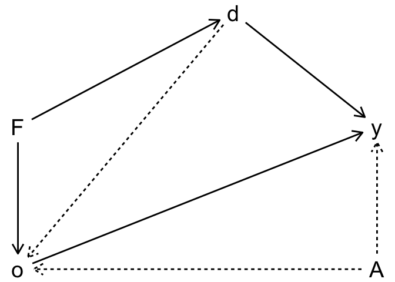
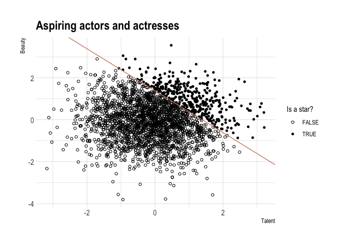

Directed acyclical graphs
================

<!-- README.md is generated from README.Rmd. Please edit that file -->

## Gender disparities controlling for occupation

``` r
library(ggraph)
library(tidygraph)

# network
net <- tribble(
  ~from, ~to, ~lt,
  'A', 'o', 'u',
  'A', 'y', 'u',
  'F', 'd', 'o',
  'F', 'o', 'u',
  'd', 'o', 'o',
  'o', 'y', 'o'
  )
net %<>% as_tbl_graph(directed = T)

# dag
ggraph(net, layout = 'kk') +
  geom_edge_link(
    aes(linetype = lt),
    arrow = arrow(length = unit(2, "mm")),
    start_cap = circle(7, "mm"), end_cap = circle(7, "mm")
  ) + 
  geom_node_point() +
  geom_node_text(
    aes(label = name), hjust = 2, vjust = 1
  ) +
  theme_void() +
  theme(legend.position = 'none')
```



``` r
# construct the data
set.seed(8)
dat <- tibble(
  female = as.numeric(runif(1E4, 0, 1) >= 0.5),
  ability = rnorm(1E4, 0, 1)
  )

# outcomes
#   discrim = all females experience discrimination
#   occupat = f(ability, discrimination) (no discrim <=> M/F sort the same)
#   wage = g(ability, discrimination, occupation)
dat %<>% mutate(
  discrim = female,
  occupat = 1 + 2 * ability + 0 * female - 2 * discrim + rnorm(1E4, 0, 1),
  wage = 1 + 2 * ability - 1 * discrim + 1 * occupat + rnorm(1E4, 0, 1)
  )

# regressions
#   unconditional effect of discrimination: wage (direct) + occupat (indirect)
#   adding occupation controls for collider!: female -> occupat <- ability
#   correct specification
reg <- list(
  lm(wage ~ discrim, data = dat),
  lm(wage ~ discrim + occupat, data = dat),
  lm(wage ~ discrim + occupat + ability, data = dat)
  )

# table 8
labs <- c('Biased unconditional', 'Biased', 'Unbiased conditional')
vars <- c('Female', 'Occupation', 'Ability')
stargazer(
  reg,
  column.labels = labs,
  covariate.labels = vars,
  notes = '@ p < 0.10, @@ p < 0.05, @@@ p < 0.01',
  notes.append = F,
  star.char = c("@", "@@", "@@@"),
  type = 'html'
  )
```

<table style="text-align:center">

<tr>

<td colspan="4" style="border-bottom: 1px solid black">

</td>

</tr>

<tr>

<td style="text-align:left">

</td>

<td colspan="3">

<em>Dependent variable:</em>

</td>

</tr>

<tr>

<td>

</td>

<td colspan="3" style="border-bottom: 1px solid black">

</td>

</tr>

<tr>

<td style="text-align:left">

</td>

<td colspan="3">

wage

</td>

</tr>

<tr>

<td style="text-align:left">

</td>

<td>

Biased unconditional

</td>

<td>

Biased

</td>

<td>

Unbiased conditional

</td>

</tr>

<tr>

<td style="text-align:left">

</td>

<td>

(1)

</td>

<td>

(2)

</td>

<td>

(3)

</td>

</tr>

<tr>

<td colspan="4" style="border-bottom: 1px solid black">

</td>

</tr>

<tr>

<td style="text-align:left">

Female

</td>

<td>

\-2.994<sup>@@@</sup>

</td>

<td>

0.604<sup>@@@</sup>

</td>

<td>

\-0.976<sup>@@@</sup>

</td>

</tr>

<tr>

<td style="text-align:left">

</td>

<td>

(0.085)

</td>

<td>

(0.029)

</td>

<td>

(0.028)

</td>

</tr>

<tr>

<td style="text-align:left">

</td>

<td>

</td>

<td>

</td>

<td>

</td>

</tr>

<tr>

<td style="text-align:left">

Occupation

</td>

<td>

</td>

<td>

1.802<sup>@@@</sup>

</td>

<td>

1.009<sup>@@@</sup>

</td>

</tr>

<tr>

<td style="text-align:left">

</td>

<td>

</td>

<td>

(0.006)

</td>

<td>

(0.010)

</td>

</tr>

<tr>

<td style="text-align:left">

</td>

<td>

</td>

<td>

</td>

<td>

</td>

</tr>

<tr>

<td style="text-align:left">

Ability

</td>

<td>

</td>

<td>

</td>

<td>

1.979<sup>@@@</sup>

</td>

</tr>

<tr>

<td style="text-align:left">

</td>

<td>

</td>

<td>

</td>

<td>

(0.022)

</td>

</tr>

<tr>

<td style="text-align:left">

</td>

<td>

</td>

<td>

</td>

<td>

</td>

</tr>

<tr>

<td style="text-align:left">

Constant

</td>

<td>

2.037<sup>@@@</sup>

</td>

<td>

0.206<sup>@@@</sup>

</td>

<td>

0.988<sup>@@@</sup>

</td>

</tr>

<tr>

<td style="text-align:left">

</td>

<td>

(0.060)

</td>

<td>

(0.020)

</td>

<td>

(0.017)

</td>

</tr>

<tr>

<td style="text-align:left">

</td>

<td>

</td>

<td>

</td>

<td>

</td>

</tr>

<tr>

<td colspan="4" style="border-bottom: 1px solid black">

</td>

</tr>

<tr>

<td style="text-align:left">

Observations

</td>

<td>

10,000

</td>

<td>

10,000

</td>

<td>

10,000

</td>

</tr>

<tr>

<td style="text-align:left">

R<sup>2</sup>

</td>

<td>

0.110

</td>

<td>

0.912

</td>

<td>

0.951

</td>

</tr>

<tr>

<td style="text-align:left">

Adjusted R<sup>2</sup>

</td>

<td>

0.110

</td>

<td>

0.912

</td>

<td>

0.951

</td>

</tr>

<tr>

<td style="text-align:left">

Residual Std. Error

</td>

<td>

4.248 (df = 9998)

</td>

<td>

1.335 (df = 9997)

</td>

<td>

0.994 (df = 9996)

</td>

</tr>

<tr>

<td style="text-align:left">

F Statistic

</td>

<td>

1,241.733<sup>@@@</sup> (df = 1; 9998)

</td>

<td>

51,902.450<sup>@@@</sup> (df = 2; 9997)

</td>

<td>

65,147.980<sup>@@@</sup> (df = 3; 9996)

</td>

</tr>

<tr>

<td colspan="4" style="border-bottom: 1px solid black">

</td>

</tr>

<tr>

<td style="text-align:left">

<em>Note:</em>

</td>

<td colspan="3" style="text-align:right">

@ p \< 0.10, @@ p \< 0.05, @@@ p \< 0.01

</td>

</tr>

</table>

## Qualitative change in sign

``` r
library(sandwich)
library(lmtest)

set.seed(541)

# dag properties
#   Z -> D -> Y
#   D -> X <- Y

# construct the data 
dat <- tibble(
  z = rnorm(2500, 0, 1),
  k = rnorm(2500, 10, 4),
  d = 0
  )
dat$d[dat$k >= 12] <- 1

# add x and y
dat %<>% mutate(
  y = 50 * d + 100 + rnorm(2500, 0, 1),
  x = 50 * d + y + rnorm(2500, 50, 1)
  )

# regressions
reg <- list(
  lm(y ~ d, data = dat),
  lm(y ~ x, data = dat),
  lm(y ~ d + x, data = dat)
  )

# use stata style robust standard errors
reg <- map(reg, ~coeftest(.x, vcov = vcovHC(.x, "HC1")))

# table 9
stargazer(
  reg,
  #column.labels = labs,
  #covariate.labels = vars,
  notes = '@ p < 0.10, @@ p < 0.05, @@@ p < 0.01',
  notes.append = F,
  star.char = c("@", "@@", "@@@"),
  type = 'html'
  )
```

<table style="text-align:center">

<tr>

<td colspan="4" style="border-bottom: 1px solid black">

</td>

</tr>

<tr>

<td style="text-align:left">

</td>

<td colspan="3">

<em>Dependent variable:</em>

</td>

</tr>

<tr>

<td>

</td>

<td colspan="3" style="border-bottom: 1px solid black">

</td>

</tr>

<tr>

<td style="text-align:left">

</td>

<td colspan="3">

</td>

</tr>

<tr>

<td style="text-align:left">

</td>

<td>

(1)

</td>

<td>

(2)

</td>

<td>

(3)

</td>

</tr>

<tr>

<td colspan="4" style="border-bottom: 1px solid black">

</td>

</tr>

<tr>

<td style="text-align:left">

d

</td>

<td>

50.013<sup>@@@</sup>

</td>

<td>

</td>

<td>

0.750

</td>

</tr>

<tr>

<td style="text-align:left">

</td>

<td>

(0.042)

</td>

<td>

</td>

<td>

(0.981)

</td>

</tr>

<tr>

<td style="text-align:left">

</td>

<td>

</td>

<td>

</td>

<td>

</td>

</tr>

<tr>

<td style="text-align:left">

x

</td>

<td>

</td>

<td>

0.500<sup>@@@</sup>

</td>

<td>

0.493<sup>@@@</sup>

</td>

</tr>

<tr>

<td style="text-align:left">

</td>

<td>

</td>

<td>

(0.0003)

</td>

<td>

(0.010)

</td>

</tr>

<tr>

<td style="text-align:left">

</td>

<td>

</td>

<td>

</td>

<td>

</td>

</tr>

<tr>

<td style="text-align:left">

Constant

</td>

<td>

99.983<sup>@@@</sup>

</td>

<td>

24.985<sup>@@@</sup>

</td>

<td>

26.108<sup>@@@</sup>

</td>

</tr>

<tr>

<td style="text-align:left">

</td>

<td>

(0.024)

</td>

<td>

(0.056)

</td>

<td>

(1.468)

</td>

</tr>

<tr>

<td style="text-align:left">

</td>

<td>

</td>

<td>

</td>

<td>

</td>

</tr>

<tr>

<td colspan="4" style="border-bottom: 1px solid black">

</td>

</tr>

<tr>

<td colspan="4" style="border-bottom: 1px solid black">

</td>

</tr>

<tr>

<td style="text-align:left">

<em>Note:</em>

</td>

<td colspan="3" style="text-align:right">

@ p \< 0.10, @@ p \< 0.05, @@@ p \< 0.01

</td>

</tr>

</table>

## Nonrandom sample selection

``` r
set.seed(3444)

# construct the data
dat <- tibble(
  beauty = rnorm(2500, 0, 1),
  talent = rnorm(2500, 0, 1),
  score  = beauty + talent
  )

# add collider variable: star
c85 <- quantile(dat$score, probs = 0.85)
dat %<>% mutate(
  star = score > c85
  )

# figure 7
ggplot(dat) +
  geom_point(aes(talent, beauty, shape = star)) +
  geom_abline(
    intercept = c85,
    slope = -1,
    col = ipsum_pal()(1)
  ) +
  scale_shape_manual(name = 'Is a star?', values = c(1, 16)) +
  labs(x = 'Talent', y = 'Beauty', title = 'Aspiring actors and actresses') +
  theme_ipsum()
```


