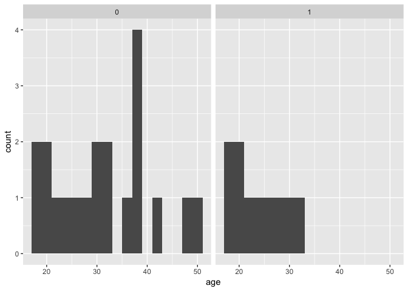
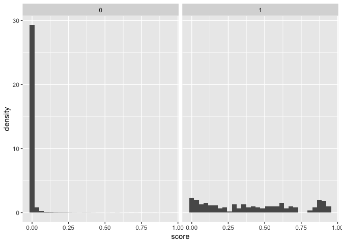

Potential outcomes causal model
================

<!-- README.md is generated from README.Rmd. Please edit that file -->

## Subclassification exercise: Titanic dataset

``` r
# get the data
dat <- titanic

# sdo
mean(dat$survived[dat$class == 1]) - mean(dat$survived[dat$class != 1])
```

    ## [1] 0.3538265

``` r
# define strata
dat %<>%
  mutate(st = case_when(sex == 0 & age == 1 ~ 'male child',
                        sex == 0 & age == 0 ~ 'male adult',
                        sex == 1 & age == 1 ~ 'female child',
                        sex == 1 & age == 0 ~ 'female adult')
         )

# male children
m_ch_1 <- mean(dat$survived[dat$st == 'male child' & dat$class == 1])
m_ch_0 <- mean(dat$survived[dat$st == 'male child' & dat$class != 1])
diff1 <- m_ch_1 - m_ch_0

# male adults
m_ad_1 <- mean(dat$survived[dat$st == 'male adult' & dat$class == 1])
m_ad_0 <- mean(dat$survived[dat$st == 'male adult' & dat$class != 1])
diff2 <- m_ad_1 - m_ad_0

# female children
f_ch_1 <- mean(dat$survived[dat$st == 'female child' & dat$class == 1])
f_ch_0 <- mean(dat$survived[dat$st == 'female child' & dat$class != 1])
diff3 <- f_ch_1 - f_ch_0

# female adults
f_ad_1 <- mean(dat$survived[dat$st == 'female adult' & dat$class == 1])
f_ad_0 <- mean(dat$survived[dat$st == 'female adult' & dat$class != 1])
diff4 <- f_ad_1 - f_ad_0

# non-first class weights
non_first <- table(dat$st[dat$class != 1])
m_ch_wt <- non_first['male child'] / sum(non_first)
m_ad_wt <- non_first['male adult'] / sum(non_first)
f_ch_wt <- non_first['female child'] / sum(non_first)
f_ad_wt <- non_first['female adult'] / sum(non_first)

# weighted effect
wate <- diff1 * m_ch_wt + diff2 * m_ad_wt + diff3 * f_ch_wt + diff4 * f_ad_wt
```

## Exact matching

``` r
# get the data
dat <- read_csv('training_example.csv')

# figure 15
ggplot(dat) +
  geom_histogram(aes(x = age), binwidth = 2) +
  facet_wrap(~trainee)
```

<!-- -->

``` r
# matching
mat <- dat %>%
  filter(trainee == 0) %>%
  group_by(age) %>%
  summarise(
    earnings = mean(earnings),
    unit = str_c(unit, collapse = ', ')
  )
dat %<>% left_join(mat, by = 'age')

# att
mean(dat$earnings.x[dat$trainee == 1]) - mean(dat$earnings.y[dat$trainee == 1])
```

    ## [1] 1695

## Bias correction

``` r
# construct the data
dat <- tribble(
  ~unit, ~y, ~y1, ~y0, ~D, ~X,
  1, 5,  5,  NA, 1, 11,
  2, 2,  2,  NA, 1, 7,
  3, 10, 10, NA, 1, 5,
  4, 6,  6,  NA, 1, 3,
  5, 4,  NA, 4,  0, 10,
  6, 0,  NA, 0,  0, 8,
  7, 5,  NA, 5,  0, 4,
  8, 1,  NA, 1,  0, 1
  )

# matching
dat$y0[1:4] <- dat$y0[5:8]

# att (biased)
mean(dat$y1[dat$D == 1] - dat$y0[dat$D == 1])
```

    ## [1] 3.25

``` r
# bias correction using OLS
reg <- lm(y ~ X, data = dat)
dat$fit_actual <- NA
dat$fit_match <- NA
dat$fit_actual[1:4] <- predict(reg, newdata = filter(dat, D == 1))
dat$fit_match[1:4] <- predict(reg, newdata = filter(dat, D == 0))

# att (corrected)
mean(dat$y1[dat$D == 1] - dat$y0[dat$D == 1] - 
       dat$fit_actual[dat$D == 1] + dat$fit_match[dat$D == 1])
```

    ## [1] 3.286451

## Dehejia and Wahba (2002)

``` r
# get the data
dat <- nsw_dw
names(dat)[c(4, 6, 7)] <- c('education', 'hispanic', 'married')
dat %<>% filter(data_id == 'Dehejia-Wahba Sample')

# ate (use controls from lalonde_1986)
ate <- mean(dat$re78[dat$treat == 1]) - 
  mean(lalonde_1986$re78[lalonde_1986$treat == 0])

# add cps controls
dat <- plyr::rbind.fill(dat, cps_controls)
dat %<>%
  mutate(
    u74 = ifelse(re74 == 0, 1, 0),
    u75 = ifelse(re75 == 0, 1, 0)
  )

# propensity score
pse <- as.formula('treat ~ 
  age + I(age ^ 2) + I(age ^ 3) + 
  education + I(education ^ 2) +
  married + nodegree + black + hispanic + re74 + re75 + u74 + u75 +
  education * re74 + hispanic * u74'
  )
psm <- glm(pse, family = binomial(link = 'logit'), data = dat)
dat$score <- predict(psm, type = 'response')

# figure 23
ggplot(dat) +
  geom_histogram(aes(x = score, y = ..density..)) +
  facet_wrap(~treat)
```

<!-- -->

``` r
# match (using arm::matching)
mat <- arm::matching(z = dat$treat, score = dat$score)
mat <- dat[mat$matched, ]
arm::balance(dat, mat, psm)
```

    ## Differences in Means of Unmatched Data
    ## --
    ##                   Treat   control       diff diff.std      se       sd
    ## age               25.82     33.23      -7.41    -0.80    0.53     9.31
    ## I(age^2)         717.39   1225.91    -508.51    -0.80   32.31   633.16
    ## I(age^3)       21554.66  49305.85  -27751.19    -0.79 1582.15 35192.68
    ## education         10.35     12.03      -1.68    -0.68    0.15     2.48
    ## I(education^2)   111.06    152.90     -41.84    -0.76    2.94    55.03
    ## married            0.19      0.71      -0.52    -1.23    0.03     0.42
    ## nodegree           0.71      0.30       0.41     0.90    0.03     0.46
    ## black              0.84      0.07       0.77     2.43    0.03     0.32
    ## hispanic           0.06      0.07      -0.01    -0.05    0.02     0.25
    ## re74            2095.57  14016.80  -11921.23    -1.57  367.15  7598.03
    ## re75            1532.06  13650.80  -12118.75    -1.75  247.78  6939.16
    ## u74                0.71      0.12       0.59     1.49    0.03     0.40
    ## u75                0.60      0.11       0.49     1.19    0.04     0.41
    ## education:re74 22898.73 171147.64 -148248.91    -1.48 4341.65 99978.93
    ## hispanic:u74       0.03      0.01       0.02     0.17    0.01     0.14
    ## --
    ## 
    ## Differences in Means of Matched Data
    ## --
    ##                   Treat  control     diff diff.std      se       sd
    ## age               25.82    25.84    -0.03     0.00    0.53     9.31
    ## I(age^2)         717.39   740.65   -23.26    -0.04   32.31   633.16
    ## I(age^3)       21554.66 23663.64 -2108.98    -0.06 1582.15 35192.68
    ## education         10.35    10.52    -0.18    -0.07    0.15     2.48
    ## I(education^2)   111.06   115.38    -4.32    -0.08    2.94    55.03
    ## married            0.19     0.19     0.00     0.00    0.03     0.42
    ## nodegree           0.71     0.63     0.08     0.18    0.03     0.46
    ## black              0.84     0.84     0.00     0.00    0.03     0.32
    ## hispanic           0.06     0.05     0.01     0.04    0.02     0.25
    ## re74            2095.57  2556.73  -461.15    -0.06  367.15  7598.03
    ## re75            1532.06  1627.76   -95.71    -0.01  247.78  6939.16
    ## u74                0.71     0.63     0.08     0.19    0.03     0.40
    ## u75                0.60     0.51     0.09     0.21    0.04     0.41
    ## education:re74 22898.73 28364.68 -5465.95    -0.05 4341.65 99978.93
    ## hispanic:u74       0.03     0.04    -0.01    -0.04    0.01     0.14
    ## --

``` r
# ate
mean(mat$re78[mat$treat == 1] - mat$re78[mat$treat == 0])
```

    ## [1] 1075.026

## Coarsened exact matching

``` r
# load cem package
library(cem)

# age cutpoints
agecut <- c(0, 10, 20, 30, 40, 60)

# variables to drop
drops <- names(dat)[c(1:2, 11, 14:15, 19)]

# implement: not working
# mat <- cem(
#   treatment = 'treat',
#   data = na.omit(dat),
#   drop = drops,
#   cutpoints = list(age = agecut)
#   )
```
