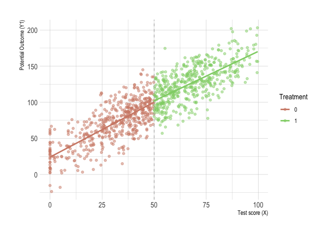
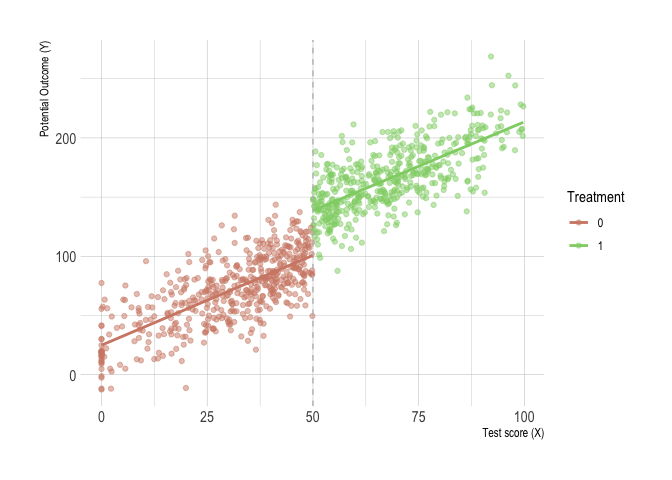
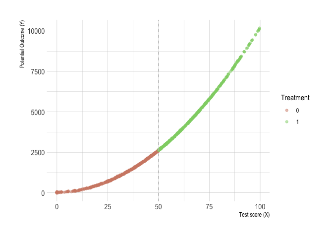

Regression discontinuity
================

<!-- README.md is generated from README.Rmd. Please edit that file -->

## Definition

``` r
set.seed(1234567)

# simulate the data
dat <- tibble(
  x = rnorm(1000, 50, 25)
  ) %>%
  mutate(
    x = if_else(x < 0, 0, x)
  ) %>%
  filter(x < 100)
skim(dat)
```

    ## Skim summary statistics
    ##  n obs: 977 
    ##  n variables: 1 
    ## 
    ## ── Variable type:numeric ───────────────────────────────────────────────────────────────
    ##  variable missing complete   n  mean    sd p0   p25   p50   p75   p100
    ##         x       0      977 977 48.72 23.17  0 33.42 48.82 66.13  99.72
    ##      hist
    ##  ▃▃▆▇▇▆▃▂

``` r
# cutoff at x = 50
dat %<>%
  mutate(
    D  = if_else(x > 50, 1, 0),
    y1 = 25 + 0 * D + 1.5 * x + rnorm(n(), 0, 20)
  )

# figure 35
ggplot(aes(x, y1, colour = factor(D)), data = dat) +
  geom_point(alpha = 0.5) +
  geom_vline(xintercept = 50, colour = "grey", linetype = 2) +
  stat_smooth(method = "lm", se = F) +
  scale_colour_ipsum(name = "Treatment") +
  labs(x = "Test score (X)", y = "Potential Outcome (Y1)") +
  theme_ipsum()
```

<!-- -->

``` r
# simulate the discontinuity
dat %<>%
  mutate(
    y2 = 25 + 40 * D + 1.5 * x + rnorm(n(), 0, 20)
  )

# figure 36
ggplot(aes(x, y2, colour = factor(D)), data = dat) +
  geom_point(alpha = 0.5) +
  geom_vline(xintercept = 50, colour = "grey", linetype = 2) +
  stat_smooth(method = "lm", se = F) +
  scale_colour_ipsum(name = "Treatment") +
  labs(x = "Test score (X)", y = "Potential Outcome (Y)") +
  theme_ipsum()
```

<!-- -->

``` r
# simultate nonlinearity
dat %<>%
  mutate(
    y3 = 25 + 0 * D + 2 * x + x ^ 2 + rnorm(n(), 0, 20)
  )

# figure 36
ggplot(aes(x, y3, colour = factor(D)), data = dat) +
  geom_point(alpha = 0.5) +
  geom_vline(xintercept = 50, colour = "grey", linetype = 2) +
  scale_colour_ipsum(name = "Treatment") +
  labs(x = "Test score (X)", y = "Potential Outcome (Y)") +
  theme_ipsum()
```

<!-- -->
