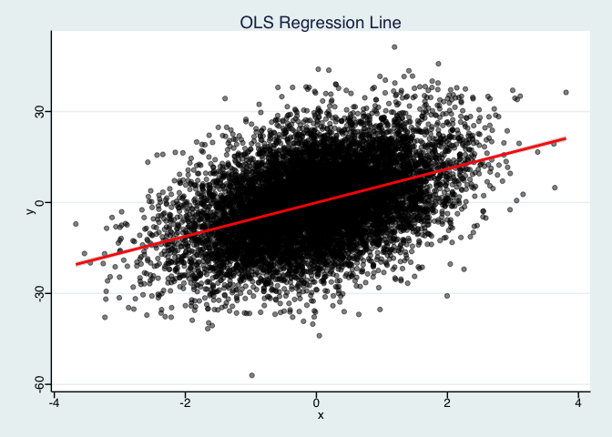
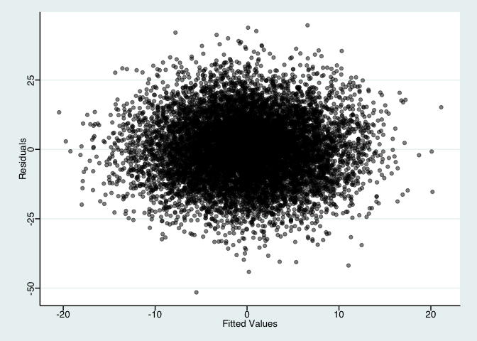
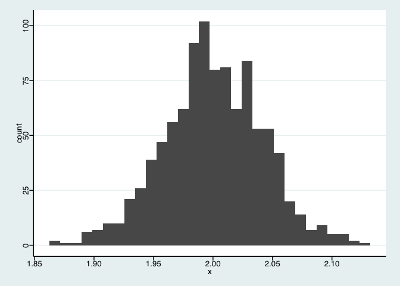
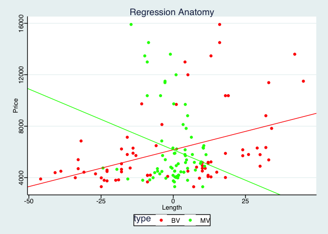
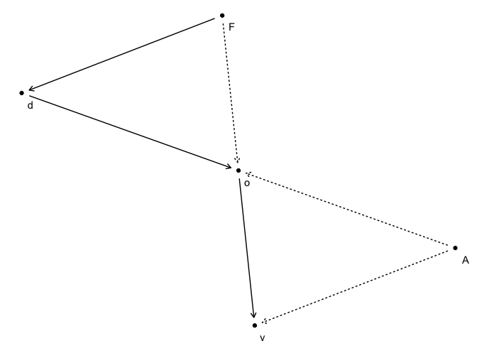
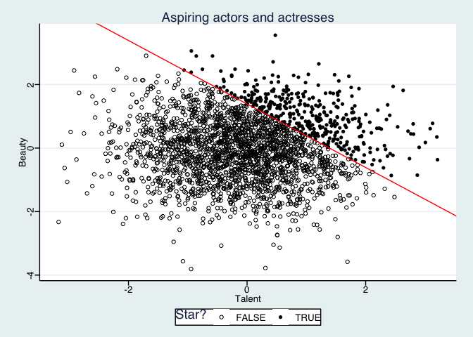

Code for Causal Inference - The Mixtape
================
Jake Johnson

# Properties of regression

## OLS regression line

``` r
set.seed(1)

# construct the data
dat <- tibble(
  x = rnorm(1E4, 0, 1),
  u = rnorm(1E4, 0, 1),
  y = 5.5 * x + 12 * u
  )

# run the regression
reg <- lm(y ~ x, data = dat)

# fitted values and residuals (two ways to recover them)
dat %<>% mutate(
  yhat1 = predict(reg) %>% unname(),
  yhat2 = coef(reg)[1] + coef(reg)[2] * x,
  uhat1 = reg$residuals %>% unname(),
  uhat2 = y - yhat2
  )

# check equality
all.equal(dat$yhat1, dat$yhat2) & all.equal(dat$uhat1, dat$uhat2)
```

    ## [1] TRUE

``` r
# figure 3
ggplot(dat, aes(x, y)) +
  geom_point(alpha = 0.5) +
  stat_smooth(method = 'lm', col = 'red') +
  labs(title = 'OLS Regression Line') +
  ggthemes::theme_stata()
```

<!-- -->

``` r
# figure 4
ggplot(dat, aes(yhat1, uhat1)) +
  geom_point(alpha = 0.5) +
  labs(x = 'Fitted Values', y = 'Residuals') +
  ggthemes::theme_stata()
```

<!-- -->

## Algebraic properties of OLS

``` r
set.seed(1234)

# construct the data
dat <- tibble(
  x = 9 * rnorm(10, 0, 1),
  u = 36 * rnorm(10, 0, 1),
  y = 3 + 2 * x + u
  )

# run the regression
reg <- lm(y ~ x, data = dat)

# algebraic calculations
dat %<>% mutate(
  yhat = predict(reg) %>% unname(),
  uhat = reg$residuals %>% unname(),
  x_uhat = x * uhat,
  yhat_uhat = yhat * uhat
  )

# table 6
out <- rbind(dat, colSums(dat))
out %<>% cbind(tibble(no = c(1:10, 'Sum')), .)
names(out) <- c(
  names(out)[1:4],
  '$\\mathbf{\\hat y}$',
  '$\\mathbf{\\hat u}$',
  '$\\mathbf{\\hat x \\hat u}$',
  '$\\mathbf{\\hat y \\hat u}$'
  )

knitr::kable(
  out,
  align = 'c',
  row.names = F,
  digits = 1,
  format = 'html'
  ) %>%
  kableExtra::row_spec(11, bold = T) %>%
  kableExtra::kable_styling()
```

<table class="table" style="margin-left: auto; margin-right: auto;">

<thead>

<tr>

<th style="text-align:center;">

no

</th>

<th style="text-align:center;">

x

</th>

<th style="text-align:center;">

u

</th>

<th style="text-align:center;">

y

</th>

<th style="text-align:center;">

\(\mathbf{\hat y}\)

</th>

<th style="text-align:center;">

\(\mathbf{\hat u}\)

</th>

<th style="text-align:center;">

\(\mathbf{\hat x \hat u}\)

</th>

<th style="text-align:center;">

\(\mathbf{\hat y \hat u}\)

</th>

</tr>

</thead>

<tbody>

<tr>

<td style="text-align:center;">

1

</td>

<td style="text-align:center;">

\-10.9

</td>

<td style="text-align:center;">

\-17.2

</td>

<td style="text-align:center;">

\-35.9

</td>

<td style="text-align:center;">

\-17.4

</td>

<td style="text-align:center;">

\-18.5

</td>

<td style="text-align:center;">

200.9

</td>

<td style="text-align:center;">

322.0

</td>

</tr>

<tr>

<td style="text-align:center;">

2

</td>

<td style="text-align:center;">

2.5

</td>

<td style="text-align:center;">

\-35.9

</td>

<td style="text-align:center;">

\-27.9

</td>

<td style="text-align:center;">

\-0.7

</td>

<td style="text-align:center;">

\-27.2

</td>

<td style="text-align:center;">

\-68.0

</td>

<td style="text-align:center;">

19.8

</td>

</tr>

<tr>

<td style="text-align:center;">

3

</td>

<td style="text-align:center;">

9.8

</td>

<td style="text-align:center;">

\-27.9

</td>

<td style="text-align:center;">

\-5.4

</td>

<td style="text-align:center;">

8.3

</td>

<td style="text-align:center;">

\-13.8

</td>

<td style="text-align:center;">

\-134.3

</td>

<td style="text-align:center;">

\-114.8

</td>

</tr>

<tr>

<td style="text-align:center;">

4

</td>

<td style="text-align:center;">

\-21.1

</td>

<td style="text-align:center;">

2.3

</td>

<td style="text-align:center;">

\-36.9

</td>

<td style="text-align:center;">

\-30.2

</td>

<td style="text-align:center;">

\-6.7

</td>

<td style="text-align:center;">

141.4

</td>

<td style="text-align:center;">

202.3

</td>

</tr>

<tr>

<td style="text-align:center;">

5

</td>

<td style="text-align:center;">

3.9

</td>

<td style="text-align:center;">

34.5

</td>

<td style="text-align:center;">

45.3

</td>

<td style="text-align:center;">

1.0

</td>

<td style="text-align:center;">

44.3

</td>

<td style="text-align:center;">

171.1

</td>

<td style="text-align:center;">

43.2

</td>

</tr>

<tr>

<td style="text-align:center;">

6

</td>

<td style="text-align:center;">

4.6

</td>

<td style="text-align:center;">

\-4.0

</td>

<td style="text-align:center;">

8.1

</td>

<td style="text-align:center;">

1.8

</td>

<td style="text-align:center;">

6.3

</td>

<td style="text-align:center;">

28.7

</td>

<td style="text-align:center;">

11.6

</td>

</tr>

<tr>

<td style="text-align:center;">

7

</td>

<td style="text-align:center;">

\-5.2

</td>

<td style="text-align:center;">

\-18.4

</td>

<td style="text-align:center;">

\-25.7

</td>

<td style="text-align:center;">

\-10.3

</td>

<td style="text-align:center;">

\-15.4

</td>

<td style="text-align:center;">

79.9

</td>

<td style="text-align:center;">

159.1

</td>

</tr>

<tr>

<td style="text-align:center;">

8

</td>

<td style="text-align:center;">

\-4.9

</td>

<td style="text-align:center;">

\-32.8

</td>

<td style="text-align:center;">

\-39.6

</td>

<td style="text-align:center;">

\-10.0

</td>

<td style="text-align:center;">

\-29.7

</td>

<td style="text-align:center;">

145.9

</td>

<td style="text-align:center;">

296.2

</td>

</tr>

<tr>

<td style="text-align:center;">

9

</td>

<td style="text-align:center;">

\-5.1

</td>

<td style="text-align:center;">

\-30.1

</td>

<td style="text-align:center;">

\-37.3

</td>

<td style="text-align:center;">

\-10.2

</td>

<td style="text-align:center;">

\-27.1

</td>

<td style="text-align:center;">

137.7

</td>

<td style="text-align:center;">

276.2

</td>

</tr>

<tr>

<td style="text-align:center;">

10

</td>

<td style="text-align:center;">

\-8.0

</td>

<td style="text-align:center;">

87.0

</td>

<td style="text-align:center;">

73.9

</td>

<td style="text-align:center;">

\-13.8

</td>

<td style="text-align:center;">

87.8

</td>

<td style="text-align:center;">

\-703.3

</td>

<td style="text-align:center;">

\-1215.7

</td>

</tr>

<tr>

<td style="text-align:center;font-weight: bold;">

Sum

</td>

<td style="text-align:center;font-weight: bold;">

\-34.5

</td>

<td style="text-align:center;font-weight: bold;">

\-42.5

</td>

<td style="text-align:center;font-weight: bold;">

\-81.5

</td>

<td style="text-align:center;font-weight: bold;">

\-81.5

</td>

<td style="text-align:center;font-weight: bold;">

0.0

</td>

<td style="text-align:center;font-weight: bold;">

0.0

</td>

<td style="text-align:center;font-weight: bold;">

0.0

</td>

</tr>

</tbody>

</table>

## Expected value of OLS

``` r
# ols function
ols <- function(...) {
  dat <- tibble(
    x = 9 * rnorm(1E4, 0, 1),
    u = 36 * rnorm(1E4, 0, 1),
    y = 3 + 2 * x + u
    )
  reg <- lm(y ~ x, data = dat)
  return(coef(reg)['x'])
}

# simulate
beta <- replicate(1E3, ols()) ; skim(beta)
```

    ## Skim summary statistics
    ## 
    ## Variable type: numeric 
    ##  variable missing complete    n mean    sd   p0  p25 p50  p75 p100
    ##      beta       0     1000 1000    2 0.041 1.87 1.97   2 2.03 2.13
    ##      hist
    ##  ▁▁▃▇▇▆▁▁

``` r
# figure 5
ggplot(tibble(x = beta)) +
  geom_histogram(aes(x)) +
  ggthemes::theme_stata()
```

<!-- -->

## Regression anatomy

``` r
# auto dataset
# dat <- read_dta('/Applications/Stata/auto.dta')
dat <- read_dta('http://www.stata-press.com/data/r8/auto.dta')

# bivariate regression
reg_b <- lm(price ~ length, data = dat)

# multivariate regression
reg_m <- lm(price ~ length + weight + headroom + mpg, data = dat)

# auxiliary regression 1 
reg_a1 <- lm(length ~ weight + headroom + mpg, data = dat)
dat %<>% mutate(length_resid = reg_a1$residuals)

# auxiliary regression 2
reg_a2 <- lm(price ~ length_resid, data = dat)

# check the values
cat(
  coef(reg_m)[['length']],
  coef(reg_a2)[['length_resid']],
  cov(dat$price, dat$length_resid) / var(dat$length_resid)
  )
```

    ## -94.49651 -94.49651 -94.49651

``` r
# construct plot data
pdat <- tibble(
  price = rep(dat$price, 2),
  length = c(dat$length - mean(dat$length), dat$length_resid),
  type = unlist(map(c('BV', 'MV'), rep, times = nrow(dat)))
  )

# shift factor (mean adjustment of length requires adjustment of intercept)
s_factor <- coef(reg_b)['length'] * mean(dat$length)

# figure 6
ggplot(pdat) +
  geom_point(aes(length, price, colour = type)) +
  scale_colour_manual(values = c('red', 'green')) +
  geom_abline(
    intercept = coef(reg_b)['(Intercept)'] + s_factor,
    slope = coef(reg_b)['length'],
    col = 'red'
    ) +
  geom_abline(
    intercept = coef(reg_a2)['(Intercept)'],
    slope = coef(reg_a2)['length_resid'],
    col = 'green'
    ) +
  labs(title = 'Regression Anatomy', x = 'Length', y = 'Price') +
  ggthemes::theme_stata()
```

<!-- -->

# Directed acyclical graphs

## Gender disparities controlling for occupation

``` r
library(ggraph)
library(tidygraph)

# network
net <- tribble(
  ~from, ~to,
  'A', 'o',
  'A', 'y', 
  'F', 'd',
  'F', 'o',
  'd', 'o',
  'o', 'y',
  )
net %<>% as_tbl_graph(directed = T)
net %<>% 
  activate(edges) %>%
  mutate(
    lty  = c('u', 'u', 'o', 'u', 'o', 'o')
    )

# dag
ggraph(net, layout = 'kk') +
  geom_edge_link(
    aes(linetype = lty),
    arrow = arrow(length = unit(2, "mm")),
    start_cap = circle(3, "mm"), end_cap = circle(3, "mm")
  ) + 
  geom_node_point() +
  geom_node_text(
    aes(label = name), hjust = -1, vjust = 2
  ) +
  theme_void() +
  theme(legend.position = 'none')
```

<!-- -->

``` r
# construct the data
set.seed(8)
dat <- tibble(
  female = as.numeric(runif(1E4, 0, 1) >= 0.5),
  ability = rnorm(1E4, 0, 1)
  )

# outcomes
#   discrim = all females experience discrimination
#   occupat = f(ability, discrimination) (no discrim <=> M/F sort the same)
#   wage = g(ability, discrimination, occupation)
dat %<>% mutate(
  discrim = female,
  occupat = 1 + 2 * ability + 0 * female - 2 * discrim + rnorm(1E4, 0, 1),
  wage = 1 + 2 * ability - 1 * discrim + 1 * occupat + rnorm(1E4, 0, 1)
  )

# regressions
#   unconditional effect of discrimination: wage (direct) + occupat (indirect)
#   adding occupation controls for collider!: female -> occupat <- ability
#   correct specification
reg <- list(
  lm(wage ~ discrim, data = dat),
  lm(wage ~ discrim + occupat, data = dat),
  lm(wage ~ discrim + occupat + ability, data = dat)
  )

# tidy the data
reg %<>% map_dfr(tidy)
reg$model <- c(
  rep('Biased unconditional', 2),
  rep('Biased', 3),
  rep('Unbiased conditional', 4)
  )

# table 8
out <- gather(reg, statistic, value, -term, -model) %>%
  filter(statistic %in% c('estimate', 'std.error')) %>%
  mutate(
    value = format(value, digits = 2),
    value = str_trim(value),
    value = if_else(statistic == 'std.error', str_c('(', value, ')'), value)
  ) %>%
  spread(model, value, fill = '') %>%
  select(-statistic)

out <- out[c(1:2, 5:6, 7:8, 3:4), c(1, 3, 2, 4)]
out[, 1] <- c(
  '(Intercept)', '',
  'Female', '',
  'Occupation', '',
  'Ability', ''
)
names(out)[1] <- c('Covariates:')
out %<>% add_row(
  `Covariates:` = 'N',
  `Biased unconditional` = '10,000',
  `Biased` = '10,000',
  `Unbiased conditional` = '10,000'
  )

knitr::kable(
  out,
  align = 'c',
  row.names = F,
  format = 'html'
  ) %>%
  kableExtra::row_spec(9, bold = T) %>%
  kableExtra::kable_styling()
```

<table class="table" style="margin-left: auto; margin-right: auto;">

<thead>

<tr>

<th style="text-align:center;">

Covariates:

</th>

<th style="text-align:center;">

Biased unconditional

</th>

<th style="text-align:center;">

Biased

</th>

<th style="text-align:center;">

Unbiased conditional

</th>

</tr>

</thead>

<tbody>

<tr>

<td style="text-align:center;">

(Intercept)

</td>

<td style="text-align:center;">

2.0366

</td>

<td style="text-align:center;">

0.2065

</td>

<td style="text-align:center;">

0.9880

</td>

</tr>

<tr>

<td style="text-align:center;">

</td>

<td style="text-align:center;">

(0.0602)

</td>

<td style="text-align:center;">

(0.0199)

</td>

<td style="text-align:center;">

(0.0172)

</td>

</tr>

<tr>

<td style="text-align:center;">

Female

</td>

<td style="text-align:center;">

\-2.9937

</td>

<td style="text-align:center;">

0.6035

</td>

<td style="text-align:center;">

\-0.9756

</td>

</tr>

<tr>

<td style="text-align:center;">

</td>

<td style="text-align:center;">

(0.0850)

</td>

<td style="text-align:center;">

(0.0292)

</td>

<td style="text-align:center;">

(0.0280)

</td>

</tr>

<tr>

<td style="text-align:center;">

Occupation

</td>

<td style="text-align:center;">

</td>

<td style="text-align:center;">

1.8018

</td>

<td style="text-align:center;">

1.0093

</td>

</tr>

<tr>

<td style="text-align:center;">

</td>

<td style="text-align:center;">

</td>

<td style="text-align:center;">

(0.0060)

</td>

<td style="text-align:center;">

(0.0099)

</td>

</tr>

<tr>

<td style="text-align:center;">

Ability

</td>

<td style="text-align:center;">

</td>

<td style="text-align:center;">

</td>

<td style="text-align:center;">

1.9794

</td>

</tr>

<tr>

<td style="text-align:center;">

</td>

<td style="text-align:center;">

</td>

<td style="text-align:center;">

</td>

<td style="text-align:center;">

(0.0221)

</td>

</tr>

<tr>

<td style="text-align:center;font-weight: bold;">

N

</td>

<td style="text-align:center;font-weight: bold;">

10,000

</td>

<td style="text-align:center;font-weight: bold;">

10,000

</td>

<td style="text-align:center;font-weight: bold;">

10,000

</td>

</tr>

</tbody>

</table>

## Qualitative change in sign

``` r
library(sandwich)
library(lmtest)

set.seed(541)

# dag properties
#   Z -> D -> Y
#   D -> X <- Y

# construct the data 
dat <- tibble(
  z = rnorm(2500, 0, 1),
  k = rnorm(2500, 10, 4),
  d = 0
  )
dat$d[dat$k >= 12] <- 1

# add x and y
dat %<>% mutate(
  y = 50 * d + 100 + rnorm(2500, 0, 1),
  x = 50 * d + y + rnorm(2500, 50, 1)
  )

# regressions
reg <- list(
  lm(y ~ d, data = dat),
  lm(y ~ x, data = dat),
  lm(y ~ d + x, data = dat)
  )

# use stata style robust standard errors
reg <- map(reg, ~coeftest(.x, vcov = vcovHC(.x, "HC1")))

# tidy the data
reg %<>% map_dfr(tidy)
reg$model <- c(
  rep(1, 2),
  rep(2, 2),
  rep(3, 3)
  )

# table 9
out <- gather(reg, statistic, value, -term, -model) %>%
  filter(statistic %in% c('estimate', 'std.error')) %>%
  mutate(
    value = format(value, digits = 2),
    value = str_trim(value),
    value = if_else(statistic == 'std.error', str_c('(', value, ')'), value)
  ) %>%
  spread(model, value, fill = '') %>%
  select(-statistic)

out$term <- c(
  '(Intercept)', '',
  'd', '',
  'x', ''
)
names(out)[1] <- c('Covariates:')
out %<>% add_row(
  `Covariates:` = 'N',
  `1` = '2,500',
  `2` = '2,500',
  `3` = '2,500'
  )

knitr::kable(
  out,
  align = 'c',
  row.names = F,
  format = 'html'
  ) %>%
  kableExtra::row_spec(7, bold = T) %>%
  kableExtra::kable_styling()
```

<table class="table" style="margin-left: auto; margin-right: auto;">

<thead>

<tr>

<th style="text-align:center;">

Covariates:

</th>

<th style="text-align:center;">

1

</th>

<th style="text-align:center;">

2

</th>

<th style="text-align:center;">

3

</th>

</tr>

</thead>

<tbody>

<tr>

<td style="text-align:center;">

(Intercept)

</td>

<td style="text-align:center;">

99.9825

</td>

<td style="text-align:center;">

24.9846

</td>

<td style="text-align:center;">

26.1083

</td>

</tr>

<tr>

<td style="text-align:center;">

</td>

<td style="text-align:center;">

(0.0241)

</td>

<td style="text-align:center;">

(0.0561)

</td>

<td style="text-align:center;">

(1.4680)

</td>

</tr>

<tr>

<td style="text-align:center;">

d

</td>

<td style="text-align:center;">

50.0134

</td>

<td style="text-align:center;">

</td>

<td style="text-align:center;">

0.7502

</td>

</tr>

<tr>

<td style="text-align:center;">

</td>

<td style="text-align:center;">

(0.0423)

</td>

<td style="text-align:center;">

</td>

<td style="text-align:center;">

(0.9811)

</td>

</tr>

<tr>

<td style="text-align:center;">

x

</td>

<td style="text-align:center;">

</td>

<td style="text-align:center;">

0.5000

</td>

<td style="text-align:center;">

0.4925

</td>

</tr>

<tr>

<td style="text-align:center;">

</td>

<td style="text-align:center;">

</td>

<td style="text-align:center;">

(0.0003)

</td>

<td style="text-align:center;">

(0.0098)

</td>

</tr>

<tr>

<td style="text-align:center;font-weight: bold;">

N

</td>

<td style="text-align:center;font-weight: bold;">

2,500

</td>

<td style="text-align:center;font-weight: bold;">

2,500

</td>

<td style="text-align:center;font-weight: bold;">

2,500

</td>

</tr>

</tbody>

</table>

## Nonrandom sample selection

``` r
set.seed(3444)

# construct the data
dat <- tibble(
  beauty = rnorm(2500, 0, 1),
  talent = rnorm(2500, 0, 1),
  score  = beauty + talent
  )

# add collider variable: star
c85 <- quantile(dat$score, probs = 0.85)
dat %<>% mutate(
  star = score > c85
  )

# figure 7
ggplot(dat) +
  geom_point(aes(talent, beauty, shape = star)) +
  geom_abline(
    intercept = c85,
    slope = -1,
    col = 'red'
  ) +
  scale_shape_manual(name = 'Star?', values = c(1, 16)) +
  labs(x = 'Talent', y = 'Beauty', title = 'Aspiring actors and actresses') +
  ggthemes::theme_stata()
```

<!-- -->

# Potential outcomes causal model

## Yule (1899)

``` r
# reshape yule to long
pat <- '(^[A-z]+[65]*)(\\d{2,4})(_\\d|O|I)*'
dat <- gather(yule, variable, value, -1:-7)
dat %<>% mutate(
  series = str_replace(dat$variable, pat, '\\1\\3'),
  year = str_replace(dat$variable, pat, '\\2')
  ) %>%
  filter(!year %in% c('7181', '8191')) %>%
  select(-variable)

# fix two digit years
dat %<>% within({
  year[year %in% str_c(7:9, 1)] <- str_c(18, year[year %in% str_c(7:9, 1)])
  })
dat$year %<>% as.numeric()

# reshape yule to wide (panel data)
dat %<>% spread(series, value, c(-1:-7, -10), fill = NA)

# prefer Popn_2 for population changes
dat %<>% mutate(
  Popn_2 = ifelse(is.na(Popn_2), Popn, Popn_2)
  )

# calculate out/old ratios
dat %<>% mutate(
  outratio = (ChABO + ChNotABO + FABO + FNotABO + MABO + MNotABO) / 
    (ChABI + ChNotABI + FABI + FNotABI + MABI + MNotABI),
  oldratio = (F65 + M65) / Popn_2,
  outratio = ifelse(outratio == Inf, NA, outratio),
  oldratio = ifelse(oldratio == Inf, NA, oldratio)
  )

# calculate decadal changes
dat %<>%
  group_by_at(1:7) %>%
  mutate(
    dpop  = Popn_2 / lag(Popn_2, order_by = year) * 100,
    dold  = oldratio / lag(oldratio, order_by = year) * 100,
    dout  = outratio / lag(outratio, order_by = year) * 100,
    dpaup = pauper / lag(pauper, order_by = year) * 100
  )

# impute dpop (= 0) if only missing 1891
IDs <- dat %>%
  group_by(ID) %>%
  summarise(na = sum(is.na(Popn_2))) %>%
  filter(na == 2) %>%
  use_series('ID')
dat %<>% mutate(
  dpop  = ifelse(is.na(dpop) & year == 1891 & !ID %in% IDs, 0, dpop)
  )

# adjust if change in paupers == Inf
dat %<>% mutate(
  dpaup = ifelse(dpaup == Inf, NA, dpaup)
  )

# model of poverty and public assistance
reg <- lm(dpaup ~ dout + dold + dpop, data = filter(dat, Type > 1))
reg
```

    ## 
    ## Call:
    ## lm(formula = dpaup ~ dout + dold + dpop, data = filter(dat, Type > 
    ##     1))
    ## 
    ## Coefficients:
    ## (Intercept)         dout         dold         dpop  
    ##    81.39195      0.31246     -0.03133     -0.22418

## Simple difference in means decomposition
